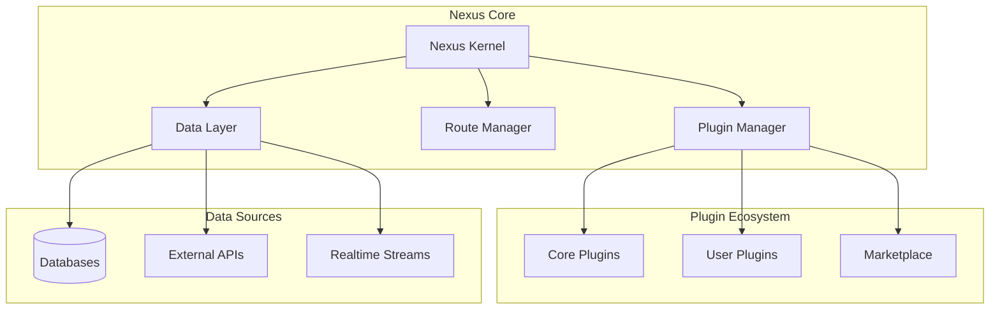

# 🚀 Nexus: Technical Specification & Implementation Plan

## Problem Statement

Modern organizations struggle with fragmented internal tooling ecosystems, paying $1000s/month for multiple SaaS solutions (Retool, Forest Admin, Metabase) while lacking full control over their data and customization options. Development teams waste months building custom admin panels from scratch for each project, resulting in inconsistent UX, duplicated logic, and maintenance nightmares.

## Solution Overview

**Nexus** is an open-source, SvelteKit-based admin framework that provides a unified platform for building internal tools, analytics dashboards, and custom admin interfaces with complete code ownership and extensibility.

```typescript
// Core Philosophy
interface NexusFramework {
 foundation: 'SvelteKit + TypeScript';
 approach: 'Convention over Configuration';
 architecture: 'Plugin-based, Progressive Enhancement';
 deployment: 'Self-hosted or Edge (Vercel/Cloudflare)';
 licensing: 'MIT Open Source';
}
```

## 🏗️ Technical Architecture

### Core Stack

```yaml
Frontend:
  - Framework: SvelteKit 2.x / Svelte 5
  - Language: TypeScript (strict mode)
  - Styling: Tailwind CSS + CSS Variables for theming
  - Components: Custom component library + Shadcn-svelte port
  - State: Svelte 5 Runes + Tanstack Query
  - Forms: Superforms + Zod validation

Backend:
  - Runtime: Node.js 20+ / Bun
  - API: tRPC or Hono (type-safe endpoints)
  - ORM: Drizzle (primary) / Prisma (optional)
  - Auth: Lucia Auth v3 + Arctic (OAuth)
  - Realtime: PartyKit or Socket.io
  - Queue: BullMQ or Trigger.dev

Infrastructure:
  - Database: PostgreSQL, MySQL, SQLite, MongoDB
  - Cache: Redis / Upstash
  - Storage: S3-compatible (AWS/R2/Minio)
  - Search: MeiliSearch / Typesense
  - Monitoring: OpenTelemetry compatible
```

### System Architecture



## 📦 Core Modules to Build

### 1. **Nexus Kernel** - The Foundation

```typescript
interface NexusKernel {
  // Core responsibilities
  bootstrap(): Promise<void>
  registerPlugin(plugin: NexusPlugin): void
  loadConfiguration(config: NexusConfig): void
  initializeDataSources(sources: DataSource[]): void
  setupMiddleware(middleware: Middleware[]): void
  handleRouting(routes: RouteManifest): void
}

// Key features to implement:
- Plugin lifecycle management
- Dependency injection container
- Event bus for inter-plugin communication
- Configuration cascade (defaults → file → env → runtime)
- Hot module replacement for development
```

### 2. **Data Abstraction Layer**

```typescript
interface DataLayer {
  // Universal data operations
  query<T>(datasource: string, query: Query): Promise<T>
  mutate<T>(datasource: string, mutation: Mutation): Promise<T>
  subscribe<T>(datasource: string, subscription: Subscription): Observable<T>

  // Schema introspection
  getSchema(datasource: string): Promise<Schema>
  generateTypes(schema: Schema): TypeDefinition

  // Caching layer
  cache: CacheStrategy
  invalidate(pattern: string): void
}

// Adapters to implement:
- PostgreSQL/MySQL (via Drizzle)
- MongoDB
- REST APIs
- GraphQL endpoints
- Supabase/Firebase
- Google Sheets
```

### 3. **Auto-CRUD Generator**

```typescript
interface CRUDGenerator {
 // Automatic UI generation from schema
 generateFromSchema(schema: TableSchema): CRUDModule;

 // Customization API
 customize(
  module: CRUDModule,
  options: {
   fields?: FieldCustomization[];
   actions?: CustomAction[];
   hooks?: LifecycleHooks;
   permissions?: PermissionRules;
  }
 ): CRUDModule;

 // Features to support:
 features: {
  pagination: boolean;
  sorting: MultiColumnSort;
  filtering: AdvancedFilters;
  bulkOperations: string[];
  inlineEditing: boolean;
  revisionHistory: boolean;
  import: FileFormat[];
  export: FileFormat[];
 };
}
```

### 4. **Widget System**

```typescript
interface WidgetSystem {
  // Widget registration
  register(widget: WidgetDefinition): void

  // Widget types
  types: {
    chart: ChartWidget        // Charts, graphs
    metric: MetricWidget      // KPIs, counters
    table: TableWidget        // Data grids
    form: FormWidget          // Input forms
    custom: CustomWidget      // User-defined
  }

  // Widget API
  api: {
    data: DataBinding         // Connect to data sources
    events: EventEmitter      // Inter-widget communication
    config: Configuration     // User preferences
    export: ExportFunction    // PDF/PNG/CSV export
  }
}

// Built-in widgets to implement:
- Time series chart
- Bar/Pie/Line charts
- Data table with virtualization
- Kanban board
- Calendar view
- Map visualization
- Markdown renderer
- Code editor (Monaco)
```

### 5. **Analytics Engine**

```typescript
interface AnalyticsEngine {
 // Query builder
 queryBuilder: {
  visual: VisualQueryBuilder; // Drag-drop interface
  sql: SQLQueryBuilder; // Raw SQL support
  natural: NLQueryBuilder; // AI-powered (GPT)
 };

 // Aggregation pipeline
 aggregate(pipeline: AggregationStage[]): Promise<Result>;

 // Real-time analytics
 streaming: {
  windowFunction: WindowFunction;
  materializeView: MaterializedView;
  incrementalUpdate: IncrementalStrategy;
 };

 // Performance
 optimization: {
  queryCache: boolean;
  indexSuggestions: boolean;
  queryPlan: boolean;
  costEstimation: boolean;
 };
}
```

### 6. **Theme & Component System**

```typescript
interface ThemeSystem {
 // Design tokens
 tokens: {
  colors: ColorPalette;
  typography: TypographyScale;
  spacing: SpacingScale;
  shadows: ShadowScale;
  animations: AnimationPresets;
 };

 // Component library
 components: {
  primitives: BaseComponents; // Button, Input, etc.
  composites: CompositeComponents; // DataTable, Form, etc.
  layouts: LayoutComponents; // Sidebar, Header, etc.
 };

 // Theme builder
 builder: {
  visual: VisualThemeBuilder; // GUI editor
  export: ThemeExporter; // CSS/JSON export
  preview: LivePreview; // Real-time preview
 };
}
```

### 7. **Permission & Security Layer**

```typescript
interface SecurityLayer {
 // Authentication
 auth: {
  providers: AuthProvider[]; // OAuth, SAML, LDAP
  mfa: MultiFactor; // TOTP, SMS, WebAuthn
  session: SessionManager; // JWT/Cookie based
 };

 // Authorization
 rbac: {
  roles: Role[];
  permissions: Permission[];
  policies: Policy[]; // Attribute-based
 };

 // Security features
 security: {
  encryption: FieldEncryption; // At-rest encryption
  audit: AuditLog; // All actions logged
  rateLimit: RateLimiter; // API protection
  cors: CORSPolicy; // Cross-origin
  csp: ContentSecurityPolicy; // XSS protection
 };
}
```

### 8. **Error Tracking & Monitoring**

```typescript
interface MonitoringSystem {
 // Error capture
 errors: {
  capture: ErrorCapture; // Automatic error catching
  context: ContextCollection; // User, session, env
  grouping: ErrorGrouping; // Smart deduplication
  alerts: AlertingRules; // Slack, email, etc.
 };

 // Performance monitoring
 performance: {
  metrics: PerformanceMetrics; // Core Web Vitals
  tracing: DistributedTracing; // Request flow
  profiling: CPUProfiler; // Bottleneck detection
 };

 // Analytics
 analytics: {
  usage: UsageTracking; // Feature adoption
  funnel: FunnelAnalysis; // User flows
  retention: RetentionMetrics; // User engagement
 };
}
```

## 🛠️ Implementation Roadmap

### Phase 1: Foundation (Weeks 1-4)

```typescript
// Deliverables
- [ ] Project scaffolding with SvelteKit
- [ ] Core kernel implementation
- [ ] Plugin system architecture
- [ ] Basic data layer (PostgreSQL support)
- [ ] Authentication system (email/password + OAuth)
- [ ] Base component library
- [ ] Development environment setup
```

### Phase 2: Core Features (Weeks 5-8)

```typescript
// Deliverables
- [ ] Auto-CRUD generator
- [ ] Table widget with sorting/filtering/pagination
- [ ] Form builder with validation
- [ ] Basic dashboard layouts
- [ ] Role-based permissions
- [ ] Theme system with dark mode
- [ ] Import/Export functionality
```

### Phase 3: Advanced Features (Weeks 9-12)

```typescript
// Deliverables
- [ ] Analytics query builder
- [ ] Chart widgets (5+ types)
- [ ] Real-time updates via WebSocket
- [ ] Widget marketplace structure
- [ ] Advanced filtering & search
- [ ] Audit logging system
- [ ] Error tracking integration
```

### Phase 4: Polish & Launch (Weeks 13-16)

```typescript
// Deliverables
- [ ] Performance optimization
- [ ] Documentation site
- [ ] CLI tool for project generation
- [ ] Example projects (3+)
- [ ] Docker deployment setup
- [ ] CI/CD pipelines
- [ ] Beta release preparation
```

## 📊 Success Metrics

### Technical KPIs

```yaml
Performance:
  - First Contentful Paint: <1.5s
  - Time to Interactive: <3s
  - Lighthouse Score: >90
  - Bundle Size: <200KB (initial)

Developer Experience:
  - Time to First CRUD: <5 minutes
  - Plugin Installation: <30 seconds
  - Hot Reload Time: <100ms
  - TypeScript Coverage: 100%

Scalability:
  - Concurrent Users: 10,000+
  - Database Connections: Pooled
  - API Rate Limit: 1000 req/min
  - Data Volume: 1M+ records
```

### Adoption Goals

```yaml
Q2 2025:
  - GitHub Stars: 1,000+
  - Discord Community: 500+
  - Production Deployments: 50+
  - Plugin Contributions: 20+

Q4 2025:
  - GitHub Stars: 5,000+
  - Discord Community: 2,000+
  - Production Deployments: 500+
  - Enterprise Customers: 10+
```

## 🔧 Technical Challenges & Solutions

### Challenge 1: Plugin Isolation

```typescript
// Problem: Plugins can conflict with each other
// Solution: Sandbox execution environment

class PluginSandbox {
 private context: IsolatedContext;

 async execute(plugin: Plugin, input: any) {
  return await this.context.run(plugin.handler, input);
 }
}
```

### Challenge 2: Type Safety Across Plugins

```typescript
// Problem: Dynamic schema = loss of types
// Solution: Runtime type generation

async function generateTypes(schema: DatabaseSchema) {
 const types = await schemaToTypeScript(schema);
 await writeFile('./types/generated.d.ts', types);
 // Hot reload TypeScript server
}
```

### Challenge 3: Performance with Large Datasets

```typescript
// Problem: Rendering 100k+ rows
// Solution: Virtual scrolling + server-side operations

<VirtualTable
  data={async (params) => server.fetch(params)}
  rowHeight={40}
  overscan={5}
  serverSide={{
    sorting: true,
    filtering: true,
    pagination: true
  }}
/>
```

## 🚀 Getting Started

```bash
# Quick start (future)
npm create nexus-app@latest my-admin
cd my-admin
npm run dev

# Add a data source
nexus add datasource postgres
nexus generate crud users

# Add analytics
nexus add plugin @nexus/analytics
nexus add widget @nexus/charts

# Deploy
nexus deploy --platform=vercel
```

## 🎯 Next Steps

1. **Validate technical approach** with proof-of-concept
2. **Build minimal prototype** (2 weeks)
3. **Gather community feedback** via RFC process
4. **Establish core team** (3-5 developers)
5. **Secure initial funding** or sponsorship
6. **Launch beta program** with early adopters

This technical specification provides the foundation for building Nexus as a production-ready, enterprise-grade admin framework that can compete with existing solutions while maintaining the flexibility and developer experience that modern teams expect.
